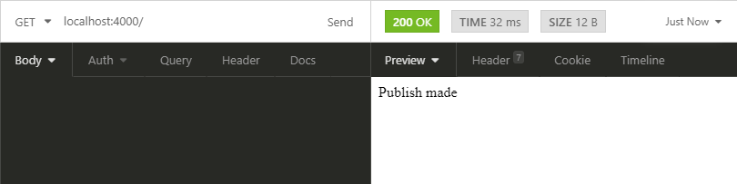

# API broker MQTT :desktop_computer:

:octocat: Este repositório mostra uma API de Broker MQTT básico construído usando Nodejs

--- 
# Configurando e preparando o ambiente
## Instalar o Node no seu computador.
Instale o Node a partir deste link : https://nodejs.org/.

Após instalar o Node, verifique as suas versões. 
```bash
node -v
npm -v
```
Output: 
```bash
v10.16.0
6.9.0
```

## Crie uma pasta para o projeto 
```bash
C:\Users\user\Desktop> mkdir api_mqtt
C:\Users\user\Desktop> cd api_mqtt
```
> mkdir "nome_da_pasta" cria uma nova pasta
> cd "nome_da_pasta" entra na pasta

## Inicie um projeto 
```bash
C:\Users\user\Desktop\api_mqtt> npm init -y
```
Irá ser gerado um package.json, que é o arquivo de gerenciamento do nosso projeto, onde irá estar listado o autor, dependencias usadas e etc.

```json
{
  "name": "api_mqtt",
  "version": "1.0.0",
  "description": "",
  "main": "index.js",
  "scripts": {
    "test": "echo \"Error: no test specified\" && exit 1"
  },
  "keywords": [],
  "author": "",
  "license": "ISC"
}
```
> Package.json criado

## Instalar as dependências
1. [Express.js](https://expressjs.com/pt-br/)
1. [MQTT.js](https://github.com/mqttjs/MQTT.js)
1. [CORS](https://www.npmjs.com/package/cors)
```bash
C:\Users\user\Desktop\api_mqtt> npm install mqtt --save
C:\Users\user\Desktop\api_mqtt> npm install express --save
C:\Users\user\Desktop\api_mqtt> npm install cors
```
Depois da instalação ser concluída será adicionado a sessão de dependencies ao nosso package.json:
```json
  "dependencies": {
    "cors": "^2.8.5",
    "express": "^4.17.1",
    "mqtt": "^3.0.0"
  }
```
# Desenvolvendo a API 
Na pasta do projeto, crie um arquivo chamado `api_broker.js`

Nas primeiras linhas iremos chamar as nossas dependências:

```Javascript
const express = require('express');
const mqtt = require('mqtt');
const cors = require('cors');
```

Agora para realizarmos a conexão com o servidor MQTT você poderá ver neste [reposítório](https://github.com/Lucasmaia435/mqtt_Node#desenvolvendo-o-broker)

A conexão do broker feita :
```Javascript
const options = {
    clientId: "node-user",
    username: 'user_name',
    password: 'user_pass',
    port: 'server_port',
}

const client = mqtt.connect('mqtt://server_adress',options);
```

Criando o nosso cliente responsável pelas requisições da API:
```javascript
const app = express();
```

## Realizar `subscribes` do broker da API:
```javascript
client.subscribe('topic');
/*
client.subscribe('topic1');
client.subscribe('topic2');
*/

```

## Criando as requisições
No protocolo HTTP existem diversos tipos de requisições, porém só iremos usar a `GET` nesta API.

Então criamos uma requisição do tipo `GET` para a rota `/` :

```javascript
app.use(cors());

app.get('/',(req,res) => {

});
```
O `app.use(cors())` serve para habilitar o [CORS](https://pt.wikipedia.org/wiki/Cross-origin_resource_sharing) para qualquer cliente que tente realizar uma requisição.

## Realizando um `Publish`
Dentro da nossa requisição, iremos adicionar um `publish` para o nosso broker:
```javascript
app.get('/',(req,res) => {
    client.publish("topic","this is a message from route '/'");
    res.send("Publish made");
});
```
Neste `publish` enviamos a mensagem `this is a message from route '/'` para o tópico `topic`. E sempre que um usuário realizar essa requisição, o publish será feito, e ele tera `Output`:
```bash
Publish made
```

Após a nossa requisição, adicionamos o `app.listen()`, para informar qual porta a nossa API estará funcionando:
```javascript
app.listen(4000,() => {
    console.log("Connected to port 4000");
});
```

## Executando a API

Para executar a API, abra o seu arquivo `package.json` e modifique o `scrips` para:

```JSON
"scripts": {
    "start": "node api_broker.js"
},
```

## Testando a sua API
Com o programa chamado [Insomnia](https://insomnia.rest/), podemos realizar requisições para a nossa API, a fim de testa-lá.

Após abrir o Insomnia, crie uma nova `request` do tipo `GET`:


Com a sua API em execução, coloque o seguinte endereço no Insomnia `localhost:port`, a port usada foi 4000, então temos:


Agora, apenas clicamos em `Send`e esperamos o resultado:



Pronto, sua API está pronta e testada :smile: !